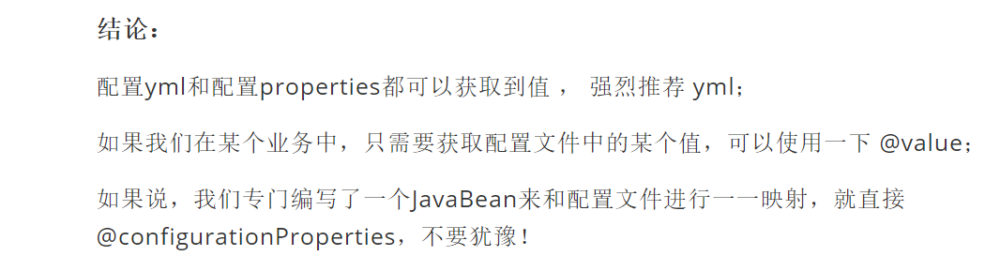

# 微服务阶段

javase：OOP

mysql（jdbc）：持久化

html+css+js+jQuary+框架：视图，框架不熟练，css审美不好；

javaweb：独立开发MVCV三层架构的网站：原始

ssm框架：简化了我们的开发流程，配置开始较为复杂

以上全是war包，在Tomcat中运行


Spring再简化：SpringBoot；微服务架构！

jar包，内嵌Tomcat

服务越来越多：SpringCloud；


http://xxxx.do


新服务框架：服务框架！


老师、领导、项目经理：

- 培训讲师：
  - 面向面试培训，叫你如何使用，快速上手！
- 做教育的：
  - 如何学习新东西，如何持续学习，如何关注这个行业！
  - 来龙去脉，历史，理论，谈资


约定大于配置：maven、spring、springmvc、springboot


程序 = 数据结构 + 算法（集合框架）；程序员

程序 = 面向对象 + 框架；码农


MVC三层架构   MVVM结构	微服务架构


业务：service： userService：====》模块！


springmvc，controller===》提供接口！


http：rpc


#### 单一应用架构

当网站流量很小时，只需一个应用，将所有功能都部署在一起，以减少部署节点和成本。此时，用于简化增删改查工作量的数据访问框架(ORM)是关键。

易于测试和开发，但是多个服务的时候


用户下单：controller！

消息队列；

仓库冻结：资金冻结；验证：购买成功，仓库数量减少，仓库解冻，资金解冻。


高内聚，低耦合


## 第一个SpringBoot程序

到底多么简单

- jdk1.8
- maven3.6.1
- SpringBoot：最新版
- idea


官方：提供了一个快速生成的网站！IDEA集成了这个网站

- 可以在官网下载之后又，导入idea开发
- 直接使用idea创建一个springboot项目（一般直接在idea中创建）


## 原理初探

**自动装配：**


pom.xml

- spring-boot-dependencies-2.2.10.RELEASE : 核心依赖在两重父项目中
- 我们在写或者引入一些SpringBoot依赖的时候，不需要指定版本，就因为有这些版本仓库


**启动器**

- ```xml
  <!--启动器-->
  <dependency>
      <groupId>org.springframework.boot</groupId>
      <artifactId>spring-boot-starter-web</artifactId>
  </dependency>
  
  <dependency>
      <groupId>org.springframework.boot</groupId>
      <artifactId>spring-boot-starter</artifactId>
  </dependency>
  
  <dependency>
      <groupId>org.springframework.boot</groupId>
      <artifactId>spring-boot-starter-test</artifactId>
      <scope>test</scope>
      <exclusions>
          <exclusion>
              <groupId>org.junit.vintage</groupId>
              <artifactId>junit-vintage-engine</artifactId>
          </exclusion>
      </exclusions>
  </dependency>
  ```

- 说白了就是SpringBoot的启动场景

- 比如spring-boot-starter-web自动导入web项目所有的依赖

- SpringBoot会将所有的功能场景，都变成一个个的启动器

- 如果我们要使用什么功能呢，就只需要找到对应的启动器就可以了 starter https://docs.spring.io/spring-boot/docs/2.2.10.RELEASE/reference/html/using-spring-boot.html#using-boot-starter


**主程序：**

```java
// SpringBootApplication 标注这个类是SpringBoot的应用
@SpringBootApplication
public class Springboot01HelloworldApplication {
    // 将SpringBoot启动
    public static void main(String[] args) {
        SpringApplication.run(Springboot01HelloworldApplication.class, args);
    }

}
```

- 注解

  ```java
  @SpringBootConfiguration   ： SpringBoot的配置
  	@Configuration ： spring配置类
      	@Component：说明这也是一个spring的组件
  
  @EnableAutoConfiguration：自动配置
      @AutoConfigurationPackage：自动配置包
      	@Import({Registrar.class})：自动配置`包注册`
      @Import({AutoConfigurationImportSelector.class})：自动配置导入选择
      // 获取所有的配置
      List<String> configurations = this.getCandidateConfigurations(annotationMetadata, attributes);
  
  ```
  
  获取候选的配置
  
  spring.factories核心配置文件
  
  
  
- 

所以的资源加载到配置类中


结论：springBoot所有的自动配置都是在启动的时候扫描并加载：spring.factories所有的自动配置类都在这里面，但是不一定生效，要判断条件是否成立，只要导入了对应的start，就有对应的启动器了，有了启动器，我们的自动装配就会生效，然后就配置成功！


1. springboot在启动的时候，从类路径下 META-INF/spring.factories获取指定的值
2. 将这些自动配置的类导入容器，自动配置类就会生效，帮我们进行自动配置
3. 以前我们需要自动配置的东西，现在SpringBoot帮我们做了
4. 整个javaee，解决方案和自动配置的东西都在spring-boot-autoconfigure-2.2.10.RELEASE.jar下
5. 他会把所有需要导入的组件，以类名的方式返回，这些组件就会被添加到容器
6. 容器中也会存在非常过的XXXXAutoConfiguration的文件（@Bean），就是这些文件给容器中导入了这个场景所需要的所有组件；并自动装配@Configuration，JavaConfig！
7. 有了自动配置类，免去了手动编写配置文件的工作


JavaConfig   @Configuration   @Bean

Docker : 进程


关于SpringBoot，谈谈你的理解：

- 自动装配

- run方法：除非重构SpringBoot，否则没必要看

  - 就四步

  - 1、推断应用的类型是普通的项目还是Web项目

    2、查找并加载所有可用初始化器 ， 设置到initializers属性中

    3、找出所有的应用程序监听器，设置到listeners属性中

    4、推断并设置main方法的定义类，找到运行的主类


全面接管SpringMVC的配置！后面就很简单了，都是实操！


## SpringBoot配置

yaml可以直接给实体类赋值


但是不会影响程序的运行

```xml
<dependency>
    <groupId>org.springframework.boot</groupId>
    <artifactId>spring-boot-configuration-processor</artifactId>
    <optional>true</optional>
</dependency>
```

如果用properties





可以通过debug： true来查看，那些配置类生效了，那些没生效


## SpringBoot Web开发

jar包：webapp！放在哪呢

自动装配

1. 创建应用，选择模块


SpringBoot到底帮我们配置了什么？能不能修改？能修改什么？能不能扩展？

- XXXAutoConfiguration、、向容器中自动配置组件
- xxxProperties：自动配置类装配配置文件中自定义的一些内容


要解决的问题：

- 导入静态资源，html，css，js
- 首页
- jsp，模板引擎Thymeleaf
- 装配扩展SpringMVC
- 增删改查
- 拦截器
- 国际化（中英文切换）


### 静态资源


jetbrains://idea/navigate/reference?project=springboot-03-web&path=E:/environments/apache-maven-3.6.2/maven-repo/org/springframework/boot/spring-boot-autoconfigure/2.3.4.RELEASE/spring-boot-autoconfigure-2.3.4.RELEASE.jar!/org/springframework/boot/autoconfigure/web/servlet/WebMvcAutoConfiguration.class

```java
public void addResourceHandlers(ResourceHandlerRegistry registry) {
    if (!this.resourceProperties.isAddMappings()) {
        logger.debug("Default resource handling disabled");
    } else {
        Duration cachePeriod = this.resourceProperties.getCache().getPeriod();
        CacheControl cacheControl = this.resourceProperties.getCache().getCachecontrol().toHttpCacheControl();
        if (!registry.hasMappingForPattern("/webjars/**")) {
            this.customizeResourceHandlerRegistration(registry.addResourceHandler(new String[]{"/webjars/**"}).addResourceLocations(new String[]{"classpath:/META-INF/resources/webjars/"}).setCachePeriod(this.getSeconds(cachePeriod)).setCacheControl(cacheControl));
        }

        String staticPathPattern = this.mvcProperties.getStaticPathPattern();
        if (!registry.hasMappingForPattern(staticPathPattern)) {
            this.customizeResourceHandlerRegistration(registry.addResourceHandler(new String[]{staticPathPattern}).addResourceLocations(WebMvcAutoConfiguration.getResourceLocations(this.resourceProperties.getStaticLocations())).setCachePeriod(this.getSeconds(cachePeriod)).setCacheControl(cacheControl));
        }

    }
}
```


什么是webjars

**第一种方式**


用maven方式引入jQuary

```xml
<dependency>
    <groupId>org.webjars</groupId>
    <artifactId>jquery</artifactId>
    <version>3.4.1</version>
</dependency>
```


总结：

1. 在SpringBoot中，我们可以使用一下方式处理静态资源
   - webjars
   - public，static，/**, resources    localhost:/8080/
2. 优先级：resources 》 static（默认） 》public


### 首页如何定制


结论：只要需要themeleaf，只需要导入对应的依赖就可以了！我们要将html放在我们的templates目录下即可！


在SpringBoot中，有非常多的XXXXConfiguration 帮你进行扩展配置。只要看见了这个东西，我们就要注意了！


1. 首页配置：
   - 注意点，所有静态资源都需要themeleaf接管 
   - @{}
2. 页面国际化：
   - 注意点，要配置i18n文件
   - 如果需要项目中进行按钮自动切换，需要自定义一个组件`LocaleResolver`
   - 记得将自己写的组件配置到Spring容器
   - #{}
3. 登录+拦截
4. 员工列表展示
   1. 提取公共页面
      1. th:fragment


前端：

- 模板：别人写好的，我们拿来改成自己需要的
- 框架：组件，自己手动拼接起来。BootStrap、Layui、semantic-ui
  - 栅格系统
  - 导航栏
  - 侧边栏
  - 表单


如何快速搭建web项目：

1. 前端搞定：页面长什么样子
2. 设计数据库【数据库设计是难点】
3. 前端让他能够自动运行（独立化工程）
4. 数据接口如何对接：json后者对象all in one
5. 前后端联调测试！


1. 有一套自己熟悉的后台模板：工作必要！x-admin
2. 前端页面：至少自己能够通过前端框架，组个一个网站页面
   - index
   - about
   - blog
   - post
   - user
3. 让这个网站能够独立运行

一个月、


## 上周回顾

- SpringBoot是什么？
- 微服务
- HElloWorld
- 探究源码~自动装配原理
- 配置yaml
- 多文档环境切换
- 静态资源映射
- Thymeleaf  th：xxx
- SpringBoot 如何扩展MVC ：JavaConfig
- 修改SpringBoot默认配置
- CRUD
- 国际化
- 拦截器
- 定制首页
- 错误页


这周：

- JDBC
- MyBatis：【重点】
- Druid：【重点】
- Shiro：安全【重点】
- Spring Security：安全【重点】
- 异步任务~，邮件发送，定时任务
- Swagger
- Dubbo + ZooKeeper


## Data

新建项目

JDBC API

MYSQL Driver

SpringData JDBC【可选】


mysql异常


这是因为jar包用的8版本的


把时区配好就行了

```yaml
url: jdbc:mysql://localhost:3306/mybatis?serverTimezone=UTC&useUnicode=true&characterEncoding=utf-8
```


源码：

```java
DataSourceProperties  // 一定对应一个autoconfig
DataSourceAutoConfigration
```


有大量的`xxxx Template` 这就是SpringBoot配置好的Bean，直接用就好


 

## MyBatis

整合包

```xml
<!-- https://mvnrepository.com/artifact/org.mybatis.spring.boot/mybatis-spring-boot-starter -->
<dependency>
    <groupId>org.mybatis.spring.boot</groupId>
    <artifactId>mybatis-spring-boot-starter</artifactId>
    <version>2.1.1</version>
</dependency>
```

M：数据和业务

V：HTML

C：交接


1. 导入包
2. 配置文件
3. mybatis配置
4. 编写sql
5. 业务（service）层调用dao层
6. controller调用service


## SpringSecurity（安全）

在web开发中，安全第一位！ 过滤器，拦截器~

功能性需求：否

做网站：安全应该在什么时候考虑？设计之初

- 漏洞，隐私泄露

- 架构一旦确定~，再加安全要改很多东西


知名框架：shiro、SpringSecurity：很像，除了类不一样，名字不一样


认证，授权（vip1， vip2，vip3）


- 功能权限
- 访问权限
- 菜单权限
- 。。。拦截器，过滤器：大量原生代码~ 冗余


MVC-----Spring-----SpringBoot-----框架思想


AOP：横切   配置类


### 简介

Spring Security 是针对Spring项目的安全框架，也是Spring Boot底层安全模块默认的技术选型，他可以实现强大的Web安全控制，对于安全控制，我们仅需要引入 spring-boot-starter-security 模块，进行少量的配置，即可实现强大的安全管理！

记住几个类：

- WebSecurityConfigurerAdapter：自定义Security策略
- AuthenticationManagerBuilder：自定义认证策略
- @EnableWebSecurity：开启WebSecurity模式      **开启某个功能都是这个enableXXXX**

Spring Security的两个主要目标是 “认证” 和 “授权”（访问控制）。

**“认证”（Authentication）**

身份验证是关于验证您的凭据，如用户名/用户ID和密码，以验证您的身份。

身份验证通常通过用户名和密码完成，有时与身份验证因素结合使用。

 **“授权” （Authorization）**

授权发生在系统成功验证您的身份后，最终会授予您访问资源（如信息，文件，数据库，资金，位置，几乎任何内容）的完全权限。

这个概念是通用的，而不是只在Spring Security 中存在。


SpringBoot2.2之后---密码编码：PasswordEncoder


**thymeleaf 和 Security整合**

```xml
<!-- https://mvnrepository.com/artifact/org.thymeleaf.extras/thymeleaf-extras-springsecurity4 -->
<dependency>
    <groupId>org.thymeleaf.extras</groupId>
    <artifactId>thymeleaf-extras-springsecurity4</artifactId>
    <version>3.0.4.RELEASE</version>
</dependency>

```

能够在thymeleaf中写security

最高支持2.0.9


**动态页面没有实现，出了点问题maven**


## Shiro

还没看


## Swagger

学习目标：

- 了解Swagger的作用和概念
- 了解前后端分离
- 在SpringBoot中集成Swagger


### Swagger简介

**前后端分离**

Vue + SpringBoot


后端时代：前端只需要管理静态页面；html==》后端。模板引擎	JSP  =》后端是主力


前后端分离时代：

- 后端：后端控制层，服务层，数据访问层【后端团队】
- 前端：前端控制层，视图层【前端团队】
  - 伪造护短数据，json。已经存在了，不需要后端，前端工程依旧能够跑起来。
- 前后端如何交互？ ==== API接口
- 前后端相对独立，松耦合；
- 前后端甚至可以部署在不同的服务器上；


产生一个问题：

- 前后端集成联调，前端人员和后端人员无法做到“及时协商，尽早解决”，最终导致问题集中爆发。


解决方案：

- 首先制定一个schema【计划提纲】，实时更新最新的API，降低集成风险；
- 早些年，指定word文档
- 前后端分离：
  - 前端测试后端接口：postman
  - 后端提供接口，需要实时更新最新的消息及改动！


**Swagger**

- 号称世界上最流行的API框架；
- RestFul API 文档在线自动生成工具=》API文档与API定义同步更新
- 直接运行，可以在线测试API接口
- 支持多种语言 java php


官网：swagger.op


在项目使用Swagger需要Springfox

- swagger2
- ui


### SpringBoot集成Swagger

1. 新建一个SpringBoot web项目

2. 导入相关依赖

   ```xml
   <!-- https://mvnrepository.com/artifact/io.springfox/springfox-swagger2 -->
   <dependency>
       <groupId>io.springfox</groupId>
       <artifactId>springfox-swagger2</artifactId>
       <version>2.9.2</version>
   </dependency>
   
   <!-- https://mvnrepository.com/artifact/io.springfox/springfox-swagger-ui -->
   <dependency>
       <groupId>io.springfox</groupId>
       <artifactId>springfox-swagger-ui</artifactId>
       <version>2.9.2</version>
   </dependency>
   
   ```

3. 编写一个HEllo工程

4. 配置Swagger ==》Config

   ```java
   @Configuration
   @EnableSwagger2 // 开启swagger2
   public class SwaggerConfig {
   }
   ```

5. 测试运行


### 配置Swagger

Swagger的bean实例 Docket

```java
@Configuration
@EnableSwagger2 // 开启swagger2
public class SwaggerConfig {

    // 配置了Swagger的Docket的bean实例
    @Bean
    public Docket docket(){
        return new Docket(DocumentationType.SWAGGER_2)
                .apiInfo(apiInfo());


    }
    // 配置swagger信息=apiinfo
    private ApiInfo apiInfo(){


        // 作者信息
        Contact contact = new Contact("李赫", "lihelearning.top", "911562554@qq.com");

        return new ApiInfo("Lihe swagger API文档",
                "Api 文档",
                "v0.1",
                "localhost",
                contact,
                "Apache 2.0",
                "http://www.apache.org/licenses/LICENSE-2.0",
                new ArrayList());
    }
}
```


### Swagger配置扫描接口

Docket.select()


我只希望我的Swagger在生产环境中使用，在发布的时候不使用？

- 判断是不是生产环境， flag=false
- 注入enable


### 配置API分组

这里还没看


## 任务

异步任务~

定时任务~ Timer


还没看


## 分布式 Dubbo + ZooKeeper + SpringBoot

### 什么是分布式系统？

在《分布式系统原理与范型》一书中有如下定义：“分布式系统是若干独立计算机的集合，这些计算机对于用户来说就像单个相关系统”；

分布式系统是由一组通过网络进行通信、为了完成共同的任务而协调工作的计算机节点组成的系统。分布式系统的出现是为了用廉价的、普通的机器完成单个计算机无法完成的计算、存储任务。其目的是**利用更多的机器，处理更多的数据**。

分布式系统（distributed system）是建立在网络之上的软件系统。

首先需要明确的是，只有当单个节点的处理能力无法满足日益增长的计算、存储任务的时候，且硬件的提升（加内存、加磁盘、使用更好的CPU）高昂到得不偿失的时候，应用程序也不能进一步优化的时候，我们才需要考虑分布式系统。因为，分布式系统要解决的问题本身就是和单机系统一样的，而由于分布式系统多节点、通过网络通信的拓扑结构，会引入很多单机系统没有的问题，为了解决这些问题又会引入更多的机制、协议，带来更多的问题。。。


阿里云|腾讯云|华为云     140               3000

黑市|黄赌毒


RPC

两个核心模块：通讯，序列化

序列化：数据传输需要转换

Netty：30天


Dubbo~ 18年重启！ Dubbo 3.x RPC


（HTTP）SpringCloud（生态）~


专业的事，交给专业的人来做~ 一定靠谱吗？不一定


前台	中台	后台


# 聊聊现在和未来

回顾以前，架构！

```java
三层架构	+	MVC
    架构 ----> 解耦

开发框架
    Spring
    	IOC		AOP
    	控制反转IOC 	约泡：泡温泉，泡茶。。。泡友
    					附近的人，打招呼，加微信，聊天，还不一定能约到--->才有可能约泡
    			   浴场（容器）：温泉，茶楼，泡友
    					直接进温泉，就有人和你一起了！
    				原来我们都是自己一步步操作，现在交给容器了！我们需要什么就去拿就可以了。
    	面相切片编程AOP：切面（本质，动态代理）
    		为了解决什么？	不影响业务本来的情况下实现动态增加功能，大量应用在日志，事务、、、等等方面
    		
    	
    	Spring是一个轻量级的Java开源框架，容器
    	目的：解决企业开发的复杂性问题
    	Spring是春天，也十分复杂，配置文件地狱
    
    SpringBoot
    	SpringBoot并不是新东西，只是Spring的升级版
    	新一代JavaEE的开发标准，开箱即用！--> 拿过来就可以用！
    	自动装配，自动配置了很多东西
    	特性：约定大于配置

随着公司体系越来越大，用户越来越多！

微服务架构---> 新架构
	模块化，功能化！
    用户模块、支付模块、签到模块、娱乐模块......
    人过于多怎么办？：一台服务器解决不了；增加服务器！	横向解决问题
    假设A服务器占用98%的资源，B服务器只占用了10%。 ---> 负载均衡
    
    将原来的整体项目，分成模块化，用户就是一个单独的项目，签到也是一个单独的项目，项目与项目之间需要通信，如何通信？
    用户非常多，而签到十分少！	给用户多一点服务器，给签到少一点服务器！
    
微服务架构问题？
    分布式架构会遇到的四个核心问题？
    1. 这么多服务，客户端该如何去访问？ |共同网关分发
    2. 这么多服务，服务与服务之间如何进行通信？
    3. 这么多服务，如何治理？	统一的管理平台
    4. 服务挂了，怎么办？

解决方案：
    生态圈：SpringCloud，是一套生态，就是来解决以上分布式架构的四个问题
    想使用SpringCloud，必须要掌握SpringBoot，因为SpringCloud是基于SpringBoot；
    
    1. Spring Cloud 	NetFlix， 出来了一套解决方案	一站式解决方案。（现在alibaba也出了）
        访问：API网关	zuul组件
        通信：Feign ---> HttpClient ---> HTTP的通信方式，同步并阻塞
        治理：服务注册与发现，Eureka
        挂了：熔断机制	Hystrix

        2018年年底，NetFlix宣布无限期停止维护。生态不再维护，就会脱节。
    2. Apache Dubbo zookeeper，第二套解决系统
    	API网关： 没有！要么找第三方组件，要么自己实现
    	Dubbo：高性能的基于Java实现的RPC通信框架
    	服务注册与发现，zookeeper：动物园管理者（Hadoop，Hive，。。。）
    	熔断机制：没有！接住了Hystrix
    
    	不完善，Dubbo3.0
    
    3. SpringCloud	Alibaba 一站式解决方案！
    	
    
目前，又提出了一种方案：
    服务网格：下一代微服务标准，service mesh
    代表解决方案：istio（未来可能需要掌握）
    
万变不离其宗，一通百通
    1. API网关，服务路由
    2. HTTP RPC框架 ，异步调用
    3. 服务注册与发现：高可用，三高问题
    4. 熔断机制，服务降级
    
如果你们可以基于这四个问题开发一套解决方案，也叫SpringCloud！
 
为什么要解决这些问题？本质：网络是不可靠的！
    
    
不要停下学习的脚步！
```

